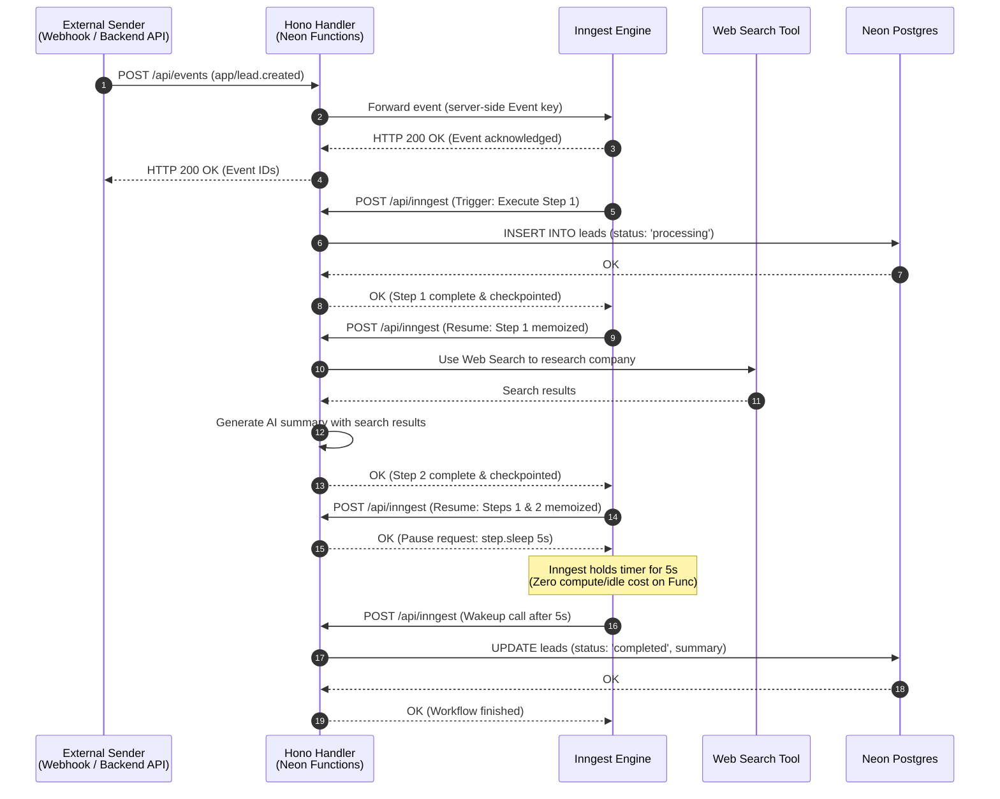
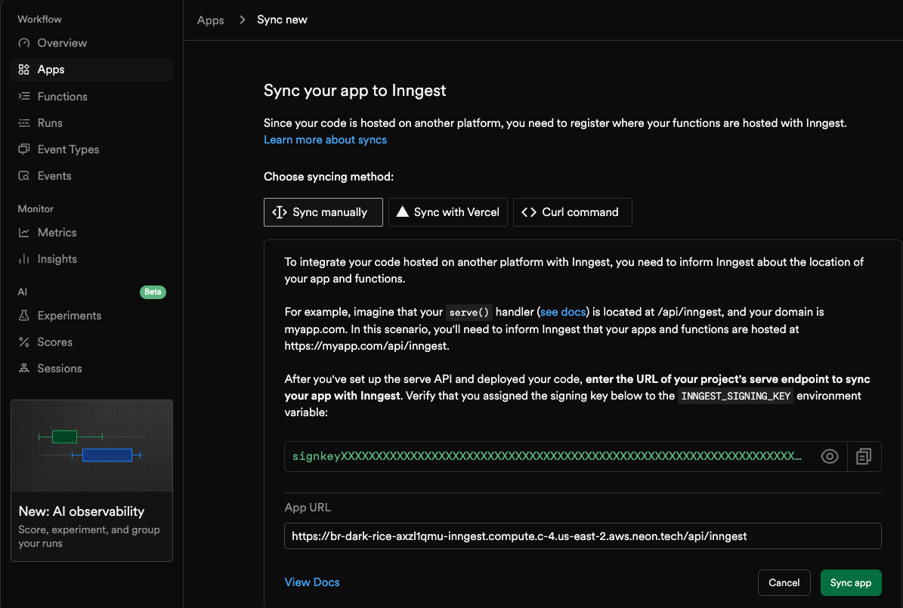
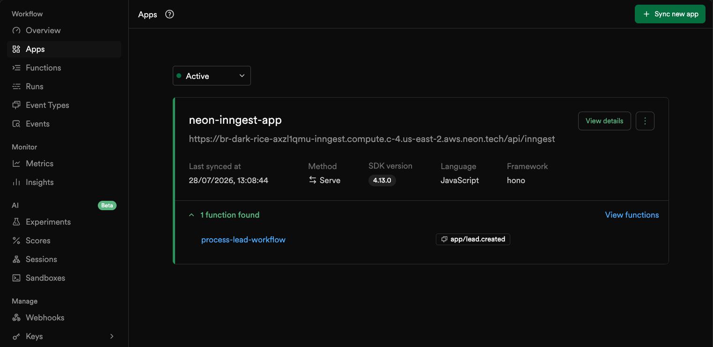

<picture>
  <source media="(prefers-color-scheme: dark)" srcset="https://neon.com/brand/neon-logo-dark-color.svg">
  <source media="(prefers-color-scheme: light)" srcset="https://neon.com/brand/neon-logo-light-color.svg">
  
</picture>

### Durable Background Workflows with Inngest & Neon Functions

An automated lead enrichment pipeline that demonstrates step-level durability, durable delays, and AI-powered research, orchestrated by Inngest and running on Neon Functions.

---

Running multi-step background work in traditional serverless architectures is inherently brittle. Short execution limits cut off long runs mid-stream, and if a single step fails, the entire workflow crashes, duplicating earlier database writes and burning through expensive API tokens on retry.

This repository solves that problem by combining [**Inngest**](https://www.inngest.com) with [**Neon Functions**](https://neon.com/docs/compute/functions/overview). Inngest provides an event-driven durable execution engine that turns your code into checkpointed steps orchestrated over standard HTTP. Neon Functions provides long-running Node.js compute sitting right next to your [Neon Postgres](https://neon.com/docs/postgres/overview) database, with [Neon AI Gateway](https://neon.com/docs/ai-gateway/overview) credentials injected automatically.

The result: linear, readable workflow code with automatic retries, step-level checkpointing, and durable delays - no separate queue infrastructure required.

Follow the full guide on [Neon: Build durable background workflows with Inngest and Neon Functions](https://neon.com/guides/durable-workflow-on-neon-functions) for a step-by-step walkthrough.

## 📐 Architecture overview



1.  **Event dispatch**: Your API sends an event to the `/api/events` proxy endpoint on your Neon Function. The proxy forwards the event to Inngest using your server-side Event key.
2.  **HTTP step orchestration**: Inngest invokes your Neon Function endpoint over HTTP (`/api/inngest`) for each discrete step in your workflow.
3.  **In-process persistence & web search**: The handler executes queries against **Neon Postgres** using `pg` and uses a web search tool to research the company and generate an executive summary.
4.  **Automatic checkpointing**: Inngest serializes and stores the return value of every completed step. If a transient failure occurs during step 2, Inngest resumes execution directly at step 2, reusing the cached output of step 1.

## ✨ Key features

-   **Step-Level Durability**: Each step in the workflow is checkpointed by Inngest. If a step fails, only that step is retried, prior steps are never re-executed.
-   **Durable Delays**: Sleep for seconds, minutes, or hours with `step.sleep` without consuming compute or incurring billing during the wait. Inngest holds the timer externally.
-   **Co-Located Compute & Data**: Neon Functions run right next to your Neon Postgres database with persistent connection pooling across invocations.
-   **AI Gateway Integration**: LLM access through the Neon AI Gateway is automatically available, no extra API keys or configuration needed.
-   **Event-Driven Architecture**: Workflows are triggered by events sent through a server-side proxy endpoint.
-   **Linear, Readable Code**: No state machines, no orchestration boilerplate. Your workflow reads top-to-bottom like a regular async function.

## 🚀 Get started

### Prerequisites

Before you start, you'll need:

1.  **[Node.js](https://nodejs.org/)** (v20+, v24 recommended) installed locally.
2.  A **[Neon account](https://console.neon.tech)**.
3.  **Neon CLI** installed globally (`npm i -g neon`) and authenticated (`neon auth`).
4.  An **[Inngest account](https://www.inngest.com)**.

### Initial setup

Clone this repository and install the dependencies.

```bash
# Clone the repository
git clone https://github.com/dhanushreddy291/durable-workflow-on-neon-functions.git
cd durable-workflow-on-neon-functions

# Install dependencies
npm install
```

### Link your Neon project

Link your local workspace to a Neon project. This creates a `.env.local` file with your database connection string and other Neon variables.

```bash
neon link
```

> When creating your Neon project, select the **AWS US East 2 (Ohio)** region (`aws-us-east-2`) since Neon Functions are currently available there during beta. Select **Yes** when prompted to manage your setup as code (`neon.ts`).

### Create the leads table

Create the `leads` table in your Neon database using the Neon CLI:

```bash
neon psql main -- -c "CREATE TABLE leads (
  id TEXT PRIMARY KEY,
  email TEXT NOT NULL,
  company TEXT NOT NULL,
  summary TEXT,
  status TEXT NOT NULL DEFAULT 'pending',
  created_at TIMESTAMPTZ DEFAULT NOW()
);"
```

### Configure environment variables

Your function needs two Inngest keys to authenticate communication between your Neon Function and Inngest Cloud.

1.  **Signing key** (`INNGEST_SIGNING_KEY`): Found in the [Inngest Cloud dashboard](https://app.inngest.com/env/production/apps) under **Apps** > **Sync new app**. Inngest uses this to sign requests it sends to your function endpoint.

2.  **Event key** (`INNGEST_EVENT_KEY`): Found on the [Inngest Cloud dashboard keys page](https://app.inngest.com/env/production/manage/keys). Your function uses this server-side key to send events to Inngest.

Add both keys to your `.env.local` file:

```bash
# ..other Neon environment variables..
INNGEST_SIGNING_KEY="signkey-prod-..."
INNGEST_EVENT_KEY="your-event-key"
```

### Deploy to Neon Functions

Deploy your function to Neon. The `neon.ts` configuration file registers `index.ts` as a deployable Neon Function and activates the AI Gateway.

```bash
neon deploy --env .env.local
```

The CLI bundles your code, configures the runtime environment, and returns your deployment's live HTTPS URL:

```text
Function URLs
  • inngest: https://br-damp-voice-xxx-inngest.compute.c-3.us-east-2.aws.neon.tech
```

Your full production Inngest endpoint is: `https://<your-function-url>/api/inngest`

### Connect to Inngest Cloud

Register your deployed Neon Function with Inngest Cloud to enable production event routing:

1.  Log in to your [Inngest Cloud Dashboard](https://app.inngest.com).
2.  Go to **Apps** > **Sync New App**.

    <p align="left">
      
    </p>

3.  Enter your deployed Neon Function Inngest URL (`https://<your-function-url>/api/inngest`) and sync the app.
4.  You should see your `process-lead-workflow` function appear in the dashboard, along with its trigger event (`app/lead.created`).

    <p align="left">
      
    </p>

### Trigger a workflow

Send an `app/lead.created` event to your deployed function's `/api/events` endpoint:

```bash
curl -X POST "https://<your-function-url>/api/events" \
  -H "Content-Type: application/json" \
  -d '{
    "name": "app/lead.created",
    "data": {
      "leadId": "lead_prod_999",
      "email": "alex@globex.com",
      "company": "Globex International"
    }
  }'
```

The workflow takes about 5–10 seconds to complete (including the 5-second durable sleep). Verify the result in your database:

```bash
neon psql main -- -c "SELECT * FROM leads WHERE id = 'lead_prod_999';"
```

The `status` column should show `completed` and the `summary` column should contain the AI-generated executive summary.

## ⚙️ How it works

This architecture relies on three core concepts working together:

1.  **Event Dispatch**:
    Your API sends an event to the `/api/events` proxy endpoint on your Neon Function. The proxy forwards it to Inngest using your server-side Event key, so the key is never exposed to callers.

    ```typescript
    // index.ts
    app.post("/api/events", async (c) => {
      const body = await c.req.json();
      const result = await inngest.send(body);
      return c.json({ ids: result.ids, status: 200 });
    });
    ```

2.  **Step Orchestration**:
    Inngest invokes your Neon Function endpoint over HTTP (`/api/inngest`) for each discrete step in the workflow. Each logical task is wrapped in a `step.run` block, which lets Inngest checkpoint and retry at the step level.

    ```typescript
    // src/inngest/functions.ts
    // Step 1: Insert lead with "processing" status
    await step.run("save-lead-to-db", async () => {
      await pool.query(
        `INSERT INTO leads (id, email, company, status) VALUES ($1, $2, $3, $4)
         ON CONFLICT (id) DO UPDATE SET status = $4`,
        [leadId, email, company, "processing"]
      );
      return { leadId, status: "processing" };
    });

    // Step 2: Research company and generate AI summary
    const aiSummary = await step.run("generate-ai-summary", async () => {
      const { text } = await generateText({
        model: neon("gpt-oss-120b"),
        prompt: `Research the company "${company}"...`,
        tools: { webSearch },
        stopWhen: isStepCount(3)
      });
      return text;
    });

    // Step 3: Simulate a durable delay (e.g., waiting for a processing window)
    await step.sleep("wait-for-processing-window", "5s");

    // Step 4: Persist final result
    await step.run("complete-lead-processing", async () => {
      await pool.query(
        `UPDATE leads SET summary = $1, status = $2 WHERE id = $3`,
        [aiSummary, "completed", leadId]
      );
      return { leadId, status: "completed" };
    });
    ```

3.  **Automatic Checkpointing**:
    Inngest serializes and stores the return value of every completed step. If a transient failure occurs during step 2, Inngest resumes execution directly at step 2: reusing the cached output of step 1 without re-executing it or duplicating the database insert. The `retries: 3` config controls how many times a failed step is retried before the run is marked as failed.

## 🔧 Using a real web search API

The example uses a mock web search tool so you can test the full workflow without external API keys. For production, swap in a real search provider like [Brave Search](https://brave.com/search/api/), [Tavily](https://tavily.com/) or [Exa](https://exa.ai), just replace the `execute` function in the `webSearch` tool with a call to your provider's API. See the [guide](https://neon.com/guides/inngest-neon-functions#using-a-real-web-search-api) for a complete Brave Search implementation.

## 📚 Learn more

-   [Neon Guide: Build durable background workflows with Inngest and Neon Functions](https://neon.com/guides/durable-workflow-on-neon-functions)
-   [Neon Functions Overview](https://neon.com/docs/compute/functions/overview)
-   [Neon AI Gateway](https://neon.com/docs/ai-gateway/overview)
-   [Neon AI SDK Provider](https://github.com/neondatabase/neon-pkgs/tree/main/packages/ai-sdk-provider)
-   [Inngest Documentation](https://www.inngest.com/docs)
-   [Vercel AI SDK Documentation](https://ai-sdk.dev/docs/introduction)
